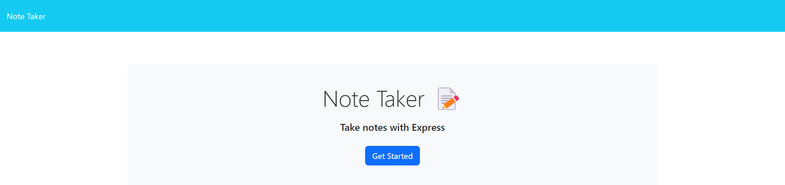

# Note Taker Application


## Description
A note taking application to organize and keep track of tasks.

## Table of Contents
* [Usage](#usage)
* [Installation](#installation)
* [Tests](#tests)
* [Deployment](#deployment)
* [Screenshots](#screenshots)
* [License](#license)
* [Contribution](#contribution)
* [Questions](#questions)

## Usage

- When user launches the webpage using the URL provided, the user is presented with a landing page with a link to a notes page.
- When user clicks on the link to the notes page, the user is presented with a page with existing notes listed in the left hand column, plus empty fields to enter a new note title and the note’s text in the right-hand column.
- When user enters a new note title and note's text, a save icon appears in the navigation at the top of the page.
- When user clicks on save icon, the new note user has entered is saved and appears in the left-hand column with the other existing notes.
- When user clicks on an existing note in the list in the left hand column, that note appears in the right-hand column.
- When user clicks on write icon in the navigation at the top of the page, the user is presented with empty fields to enter a new note title and the note’s text in the right-hand column.
- When user deletes an existing note in the list in the left hand column, the note is deleted from the list in the left hand column and the database.

## Installation
To install necessary dependencies, run the following command:
```
N/A
```

## Tests
To run tests, run the following command:
```
N/A
```

## Deployment
Deployed webpage:https://mysterious-cove-92660.herokuapp.com/

## Screenshots
Landing Page



Notes Page


## License
The project is licensed under: MIT.

## Contribution
Contact me

## Questions
If you have any questions about the repository, open an issue or contact me directly at hselin_83@yahoo.com. You can find more of my work at [NileshPatel83](https://github.com//NileshPatel83).
